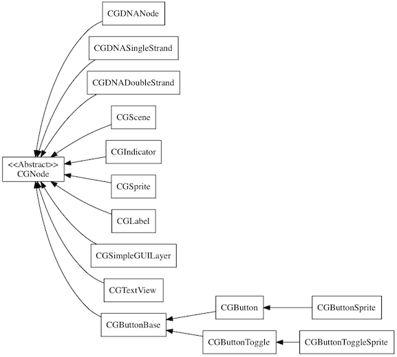
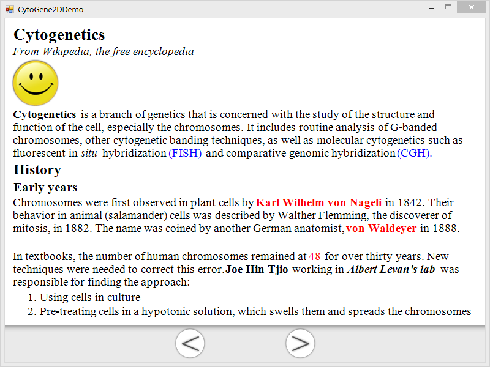
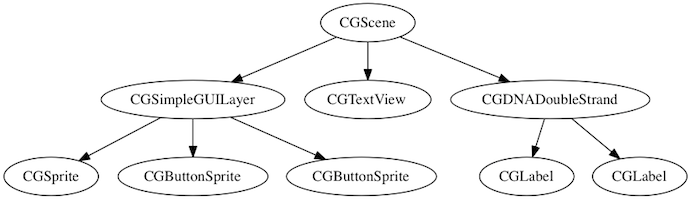
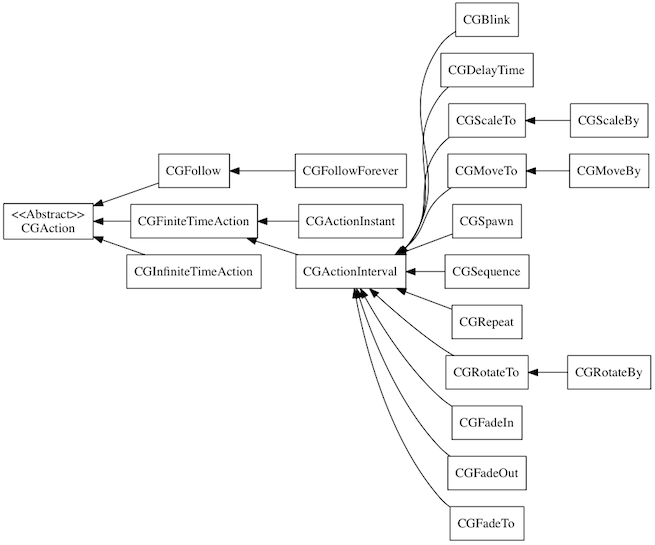
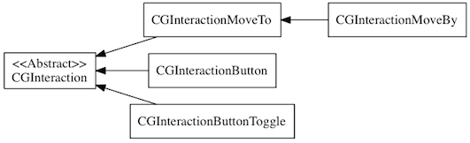

CytoGene2D
==========
CytoGene2D is a 2D graphics framework, originally designed for easily building programs about learning cytogenetics. It ultilize GDI+ APIs for low level drawing.  
*Inspired by Cocos2d.*

#Naming
1. All classes in the framework has the prefix, "CG", which stands for Cytogenetics.
2. Method name and variable start with a low case letter. Refer to Java's naming guide.
	* Setters are, for example, `setFoo(foo As Object)`
	* Getters are without the 'get', for example, `foo() As Object`
3. Sigleton class provides a method `shared<CLASSNAME>() As Object` as a global access point. For example, you can get the shared director of CGDirector class by calling `sharedDirector()`.
4. Prefer clearly self-explained method name. That means, if a long method name is needed, then just do it. For example, an obverser want to register itself to the notification center. It calls the method `registerObserverForNotification(observer As IObserver, notificationName As String)`. 
5. Avoid using abbreviation, unless it is commonly known. Other programmer may have difficulty in understanding the purpose of your methods, and abbreviation cannot really save your time since you will be using a morden editor or IDE.

#Basic Concepts
1. CGDirector is the boss, and there is only one director, since it is a singleton. The director is in charge of updating the presentation, and dispatching works (i.e. handling user inputs) to different components. Therefore, the director is reasonable to be seen as the center of the framework.
2. Layered presentation. Just think about how you use photoshop, a picture is composed of different layers. For those who have no experience with photoshop, refer to the [Layers wiki][1]. Displaying elements, such as sprites and labels, are added onto the screen, and all together form a complete picture.   
 
3. Make objects move! All displaying object in the framework provides a common interface, `runAction(action As CGAction)`. Say, you have a image called "cat" and a CGAction instance "walk". Then by calling `cat.runAction(walk)` you can actually see the cat walking on the screen. Pretty simple, huh?   
*There are many different kinds of actions. We will explore them later.*
4. Make objects interactive! All object can respond to users input, as long as it is enabled (disabled by default). Interaction will expect a specific input event, and when it receives it, a user-defined handler will be called. It, similar with the actions (i.e. "walk"), can be associated with an object. Here is a simple example, assuming that you want to dismiss a "cat" once you click on it. You instantiate a CGInteraction object, which is a click interaction and has its completion handler defined to handle the click event. Here, the completion handler will be removing the "cat" off from screen. Not hard also, right?  
*There are many different kinds of interactions. We will explore them later.*

#Details... in Brief
Here goes the details of the framework. 

##Displaying Elements
Displaying elements are derived from CGNode.  
  
Seen from diagram, there are a lot of different displaying elements. 
All the displaying elements has common properties such as `location`, `boundingBox`, `zOrder`, `opacity` and so on.  
**The table below shows all the public properties of CGNode.**    

Public Properties 		| Description
-----------------------	| -------------------
location         		| Upper-left point	
center         			| Center point
originalContentSize		| Original content size
contentSize				| Content size when displaying. The size may differ with the originalContentSize if scale is not 1.
boundingBox				| Bounding box of a displaying element
zOrder					| The depth of a displaying element. Displaying elements with greater zOrder value are more close to user
scale					| 0~1. Default is 1, means no scale.
scaleX					| Scale along X (vertical) direction.
scaleY					| Scale along Y (horizontal) direction.
opacity					| 0~255. Default is 255, means it is opaque. 0 means transparent.
rotation				| 0~360. Default is 0, means no rotation.
tag						| Default is 0. Assign a special number to look an object up easily.
parent					| The parent node
children				| All children nodes. Arraylist.
visible					| True if visible. Otherwise, not visible.
userInteractionEnabled	| True if can accept user's input. Otherwise, cannot.

###CGSprite
CGSprite is maybe the mostly used class. It can present a image on your screen.

###CGTextView
As is design for building learning programs. The text view is designed to display rich-formated text. It has special grammar to control the attribute (i.e. font face, color) of the text. Below is the grammar.
####CGTextView Grammar
">": First level heading  
">>": Second level heading   
">>>": Third level heading   
"#": Ordered list   
"*": Unordered list   
"<:\xx>": The format of the tag to control the format of a string.    
"<:\img>image_file_path": The special tag for displaying a image. One example is, "<:\img>imges\smile.png". Note 1: "image_file_path" is the relative path to the executable file. Note 2: after applying the image tag, the font attributes are cleared. Therefore, you should add the font attribute again before the next paragraph!   
Available formats:
      
1. Font
	* "<:\fr>": Regular font
	* "<:\fi>": Italic font
	* "<:\fb>": Bold font
	* "<:\fu>": Underline font
2. Color
	* "<:\ck>": Black color
	* "<:\cr>": Red color
	* "<:\cb>": Blue color

Multiple format tags can be combined to synthesise a new format. For example, "<:\fi\fb\cr>", this tag represents the string is bold and italic with a red color.   
Following is a complete example of how to use the tags.

```
>Cytogenetics
<:\fi>From Wikipedia, the free encyclopedia
<:\img>images\smile.png
<:\fb>Cytogenetics <:\fr>is a branch of genetics that is concerned with the study of the structure and 
function of the cell, especially the chromosomes. It includes routine analysis of G-banded chromosomes, 
other cytogenetic banding techniques, as well as molecular cytogenetics such as fluorescent in <:\fi>situ 
<:\fr>hybridization <:\cb>(FISH) <:\ck>and comparative genomic hybridization <:\cb>(CGH).
>>History
>>>Early years
<:\ck>Chromosomes were first observed in plant cells by <:\cr\fb>Karl Wilhelm von Nageli <:\ck\fr>in 1842.
Their behavior in animal (salamander) cells was described by Walther Flemming, the discoverer of mitosis, in 
1882. The name was coined by another German anatomist, <:\cr\fb>von Waldeyer <:\ck\fr>in 1888.
In textbooks, the number of human chromosomes remained at <:\cr>48 <:\ck>for over thirty years. New 
techniques were needed to correct this error. <:\fb>Joe Hin Tjio <:\fr>working in <:\fi\fb>Albert Levan's 
lab <:\fr>was responsible for finding the approach:
#Using cells in culture
#Pre-treating cells in a hypotonic solution, which swells them and spreads the chromosomes
#Arresting mitosis in metaphase by a solution of colchicine
#Squashing the preparation on the slide forcing the chromosomes into a single plane
#Cutting up a photomicrograph and arranging the result into an indisputable karyogram.
>>Fluorescent in situ hybridization
Fluorescent in situ hybridization refers to using fluorescently labeled probe to hybridize to cytogenetic 
cell preparations.
In addition to standard preparations <:\cb>FISH <:\ck>can also be performed on:
*bone marrow smears
*blood smears
*paraffin embedded tissue preparations
*enzymatically dissociated tissue samples
*uncultured bone marrow
*uncultured amniocytes
*cytospin preparations
``` 



###CGButtonBase
Do **NOT** forget to define click handlers of buttons. All buttons have one.

Here is an example of how displaying elements are organized.


##Actions
Different actions that can easily get what it does by the name. See diagram below.
  
Just remember **YOU CAN NEVER INSTANTIATE AN INSTANCE OF CGACTION**

##Interactions
Different interactions that can easily get what it does by the name. See diagram below.
   
Just remember **YOU CAN NEVER INSTANTIATE AN INSTANCE OF CGINTERACTION**

##Communication Between Objects
CGNotificationCenter is designed for providing a simple but effective way to allow communication among objects. As its name shows, the notification center acts like a mediator between two communitating objects. The broadcaster will send message to the notification center first, then the notification center dispatches the message to all the observers who are observing this notification.  
Each notification is identified by its notification name. That means if you plan to send out two different notifications with the same name, the notification center will have no doubt to treat those two notifications as the same one. So, please do remember this. A practical way to define notifications are using **global constant strings** (i.e. kNotificationAnimationDidFinish = "animation did finish", in your code just refer to the constant string kNotificationAnimationDidFinish, rather than hard code "animation did finish"). So that you would not get messed up with hard-coded strings.   
All observers should implement the IObserver interface. There is only one method to implement. 
  
`Sub didObserveNotification(sender As Object, notificationName As String, info As Object)`
 
* sender: there are maybe different send want to broadcast the same notification. In this case, observer need this parameter to determine if want to receive this notification or not.
* notificationName: the observer may have listen to multiple notification at the same time. For different notifications, the observer can handle differently.
* info: the message that broadcaster passes to observers. If no message to pass, then you will read `Nothing` from this field.

Observers that have registered to the notification center should be properly unregistered when do not want to receive notifications anymore. CGNotificationCenter provides methods to register and unregister.  
CGNotificationCenter also has an public method to post notifications.  
CGNotificationCenter is a special singleton. There is only one default notification center. Usually, just call `CGNotificationCenter.defaultCenter` to get a notification center. However, CGNotificationCenter allows users to instantiate a new notification center. It may be useful in some circumstances. 

[1]: http://en.wikipedia.org/wiki/Layers_(digital_image_editing)