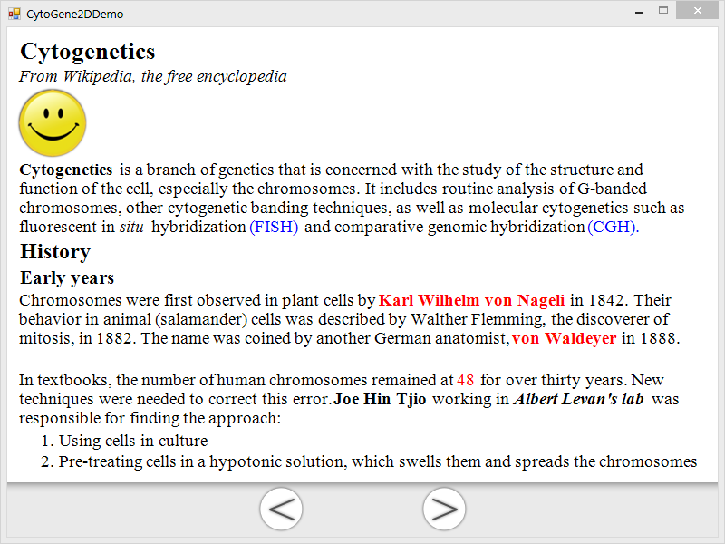

CytoGene2D
==========
CytoGene2D is a 2D graphics engine, originally designed for easily building applications about learning cytogenetics. Inspired by Cocos2d.

#Naming
1. All classes has a prefix, "CG", which stands for Cytogenetics.
2. Method name starts with a low case letter. Refer to Java's naming guide.
	* Setters should be, for example, `setFoo(foo As Object)`
	* Getters should be without the 'get', for example, `foo() As Object`

##CGTextView Grammar
">": First level heading

">>": Second level heading

">>>": Third level heading

"#": Ordered list

"*": Unordered list

"<:\xx>": The format of the tag to control the format of a string. 

"<:\img>image_file_path": The special tag for displaying a image. One example is, "<:\img>imges\smile.png". Note 1: "image_file_path" is the relative path to the executable file. Note 2: after applying the image tag, the font attributes are cleared. Therefore, you should add the font attribute again before the next paragraph!

Available formats:

1. Font
	* "<:\fr>": Regular font
	* "<:\fi>": Italic font
	* "<:\fb>": Bold font
	* "<:\fu>": Underline font
2. Color
	* "<:\ck>": Black color
	* "<:\cr>": Red color
	* "<:\cb>": Blue color

Multiple format tags can be combined to synthesise a new format. For example, "<:\fi\fb\cr>", this tag represents the string is **bold and italic with a red color.**

Following is a complete example of how to use the tags.

```
>Cytogenetics
<:\fi>From Wikipedia, the free encyclopedia
<:\img>images\smile.png
<:\fb>Cytogenetics <:\fr>is a branch of genetics that is concerned with the study of the structure and 
function of the cell, especially the chromosomes. It includes routine analysis of G-banded chromosomes, 
other cytogenetic banding techniques, as well as molecular cytogenetics such as fluorescent in <:\fi>situ 
<:\fr>hybridization <:\cb>(FISH) <:\ck>and comparative genomic hybridization <:\cb>(CGH).
>>History
>>>Early years
<:\ck>Chromosomes were first observed in plant cells by <:\cr\fb>Karl Wilhelm von Nageli <:\ck\fr>in 1842.
Their behavior in animal (salamander) cells was described by Walther Flemming, the discoverer of mitosis, in 
1882. The name was coined by another German anatomist, <:\cr\fb>von Waldeyer <:\ck\fr>in 1888.
In textbooks, the number of human chromosomes remained at <:\cr>48 <:\ck>for over thirty years. New 
techniques were needed to correct this error. <:\fb>Joe Hin Tjio <:\fr>working in <:\fi\fb>Albert Levan's 
lab <:\fr>was responsible for finding the approach:
#Using cells in culture
#Pre-treating cells in a hypotonic solution, which swells them and spreads the chromosomes
#Arresting mitosis in metaphase by a solution of colchicine
#Squashing the preparation on the slide forcing the chromosomes into a single plane
#Cutting up a photomicrograph and arranging the result into an indisputable karyogram.
>>Fluorescent in situ hybridization
Fluorescent in situ hybridization refers to using fluorescently labeled probe to hybridize to cytogenetic 
cell preparations.
In addition to standard preparations <:\cb>FISH <:\ck>can also be performed on:
*bone marrow smears
*blood smears
*paraffin embedded tissue preparations
*enzymatically dissociated tissue samples
*uncultured bone marrow
*uncultured amniocytes
*cytospin preparations
```

An example,
